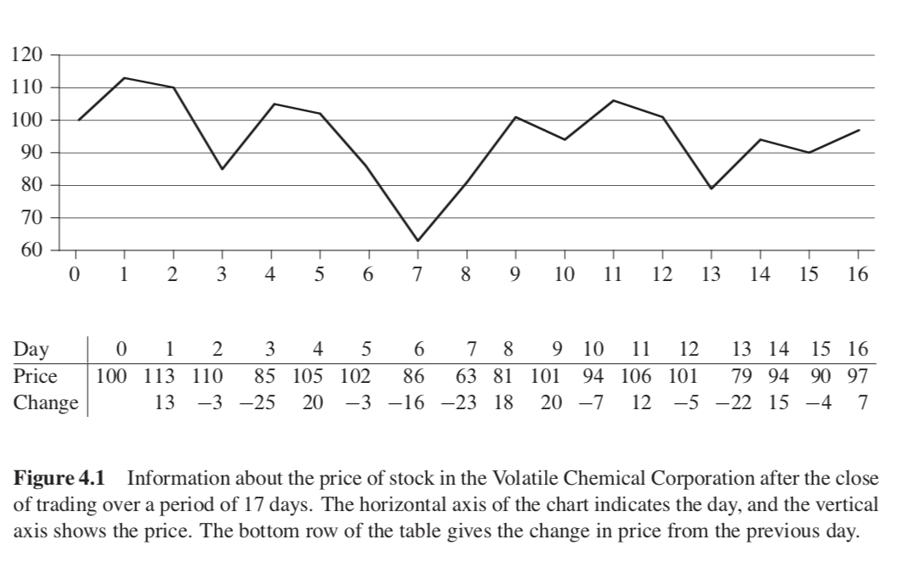

# Divide-and-Conquer

In divide-and-conquer, we solve a problem recursively, applying three steps at each level of recursion.

- **Divide** the problem into a number of subproblems that are smaller instances of the same problem.
- **Conquer** the subproblems by solving them recursively. If the subproblems’ sizes are small enough,
however, just solve the subproblems in a straightforward manner.
- **Combine** the solutions to the subproblems into the solution for the original problem.

## Recurrences

A ***recurrence*** is an equation or inequality that describes a function in terms of its value on
smaller inputs.

There are three methods of solving recurrences—that is, for obtaining asymptotic “$\Theta$” or “$O$” bounds:

- **Substitution method**: guess a bound and then use mathematical induction to prove our guess correct.

- **Recursion-tree method**: convert the recurrence into a tree whose nodes represent the costs incurred at various levels of the recursion. We use techniques for bounding summations to solve the recurrence.

- **Master method**: provide bounds for recurrences of the form:

  $$T(n) = aT(n/b) + f(n)$$,

  where $a\geq1$, $b\geq1$, and $f(n)$ is a given function. A recurrence of the form in the above equation characterizes a divide-and-conquer algorithm that creates $a$ subproblems, each of which is $1/b$ the size of the original problem, and in which  the divide and combine steps together take $f(n)$ time.

## Problems

### 1. The Maximum-Subarray Problem

Suppose that you been offered the opportunity to invest in the Volatile Chemical Corporation. Like the chemicals the company produces, the stock price of the Volatile Chemical Corporation is rather volatile. You are allowed to buy one unit of stock only one time and then sell it at a later date, buying and selling after the close of trading for the day. To compensate for this restriction, you are allowed to learn what the price of the stock will be in the future. Your goal is to maximize your profit. Figure 4.1 shows the price of the stock over a 17-day period. You may buy the stock at any one time, starting after day 0, when the price is $100 per share. Of course, you would want to “buy low, sell high”—buy at the lowest possible price and later on sell at the highest possible price—to maximize your profit. Unfortunately, you might not be able to buy at the lowest price and then sell at the highest price within a given period. In Figure 4.1, the lowest price occurs after day 7, which occurs after the highest price, after day 1. 

You might think that you can always maximize profit by either buying at the lowest price or selling at the highest price. For example, in Figure 4.1, we would maximize profit by buying at the lowest price, after day 7. If this strategy always worked, then it would be easy to determine how to maximize profit: find the highest and lowest prices, and then work left from the highest price to find the lowest prior price, work right from the lowest price to find the highest later price, and take the pair with the greater difference. Figure 4.2 shows a simple counterexample, 

