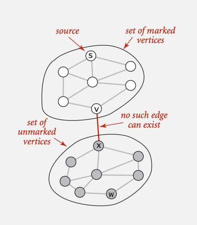
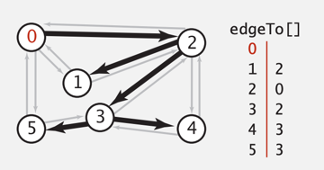

# [Depth-First Search](https://www.hackerearth.com/practice/algorithms/graphs/depth-first-search/tutorial/)

The DFS algorithm is a recursive algorithm that uses the idea of backtracking, which means that when
you are moving forward and there are no more nodes along the current path, you move backwards *on the
same path* to find nodes to traverse. All the nodes will be visited on the current path till all the
unvisited nodes have been traversed after which the next path will be selected.

This recursive nature of DFS can be implemented using *Stacks*:
- Pick a starting node and push all its adjacent nodes into a stack.
- Pop a node from the stack to select the next node to visit and push all its adjacent nodes into a
stack
- Repeat this process until the stack is empty. However, ensure that the nodes that are visited are
marked. This will prevent you from visiting the same node more than once. If you do not mark the nodes
that are visited and you visit the same node more than once, you may end up in an infinite loop.

## Motivation: Maze Exploration
**Maze Graph**
- Vertex = Intersection.
- Edge = passage connecting intersections.

**Goal** Explore every intersection (vertex in graph) in the maze.

**Algorithm: Trémaux maze exploration**
- Unroll a ball of string behind you.
- Mark each visited intersection and each visited passage.
- Retrace steps when no unvisited options.

## Depth-First Search Intuition

**Goal** Systematically search through a graph.

**Idea** Mimic maze exploration.

**Recursive Implementation**
```pseudocode
DFS-recursive (G, src):
    Mark src as visited.
    // Recursively visit all unmarked vertices w adjacent to src.
    for all neighbors v of src in graph G:
        if v is not visited (unmarked):
            DFS-recursive(G, src)
```
**Iterative Implementation**
```pseudocode
DFS-iterative(G, src):
    let S be a stack
    S.push(src) // inserting src onto the stack
    mark src as visited
    while (!S.isEmpty()):
        // Pop a vertex from the stack to visit in the next iteration.
        v = S.top()
        S.pop()
        // Push all the neighbors of v in stack that are not visited
        for all neighbors w of v in Graph G:
            if w is not visited:
                S.push(w)
                mark w as visited
```

**Applications**
- Find all vertices connected to a given source vertex.
- Find a path between two vertices.

## Design Pattern for Graph Processing

**Design pattern** Decouple graph data type from graph processing.

- Create a Graph object `graph`.
- Pass `graph` to a graph-processing routine.
- Query the graph-processing routine for information.

## Depth-First Search: Data Structures

To visit a vertex $v$, we need to:
- Mark $v$ as visited.
- Recursively visit all the unmarked vertices adjacent to $v$

**Data Structures**
- An array `boolean[] visited = new boolean[V]` to store the information of
the vertex traversal history.
- An array `edgeTo[v]` to store the path information, for instance,
`edgeTo[v1] = v2` means the graph search algorithm visits vertex `v1` via
edge `v2-v1` for the first time.
- A function call-stack for recursion.

## Depth-First Search Properties

***Proposition*** DFS marks all vertices connected to `src` in time proportional
to the sum of their degrees. (plus time to initialize the `visited[]` array.

**Proof of Correctness**
- If $w$ marked, then $w$ connected to $s$, because the only way to mark a vertex
is to get there through a sequence of recursive calls, and every recursive calls
corresponds to an edge on a path from $s$ to $w$.
- If $w$ connected to $s$, then $w$ marked. (If $w$ is unmarked, then consider
last edge on a path from $s$ to $w$ that goes from a marked vertex to an unmarked
one.



**Proof of Running Time**
- Each vertex connected to $s$ is visited exactly once.

***Proposition*** After Depth-First Search, we can find vertices connected to $s$
in constant time and can find a path to $s$ (if one exists) in time proportional
to its length.

**Proof**
- `edgeTo[]` is parent-link representation of a tree rooted at $s$.



```pseudocode
public boolean hasPathTo(int v) {
    return marked[v];
}
public Iterable<Integer> pathTo(int v) {
    if (!hasPathTo(v)) return null;
    Stack<Integer> path = new Stack<Integer>();
    for (int i = v; i != s; i = edgeTo[i])
        path.push(i);
    path.push(s);
    return path;
```


