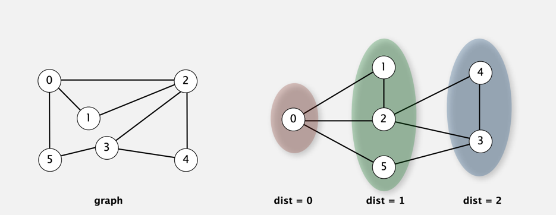

# Breadth-First Search

First thing to note is that Breadth-First Search is not a recursive algorithm, it uses a queue as an auxiliary data
structure.

## Procedure

Repeat until queue is empty:
- Remove vertex $v$ from queue.
- Add to queue all unmarked vertices adjacent to $v$ and mark them.

## Breadth-First Search

**Depth-First Search** put unvisited vertices on a *stack*.

**Breadth-First Search** put unvisited vertices on a *queue*.

**Shortest Path** find path from $s$ to $t$ that uses *fewest number of edges*.

```
BFS(from source vertex s)
-----------------------
Put s onto a FIFO queue, and mark s as visited.
Repeat until the queue is empty:
    remove the least recently added vertex v
    add each of v's unvisited neighbors to the queue and mark them as visited
```

**Intuition** BFS examines vertices in increasing distance from $s$.

## Breadth-First Search Properties

***Proposition*** BFS computes shortest paths (fewest number of edges) from $s$ to all other vertices in a graph in time
proportional to $E + V$.

**Proof of Correctness** Queue always consists of zero or more vertices of distance $k$ from $s$, followed by zero or
more vertices of distance $k + 1$.


